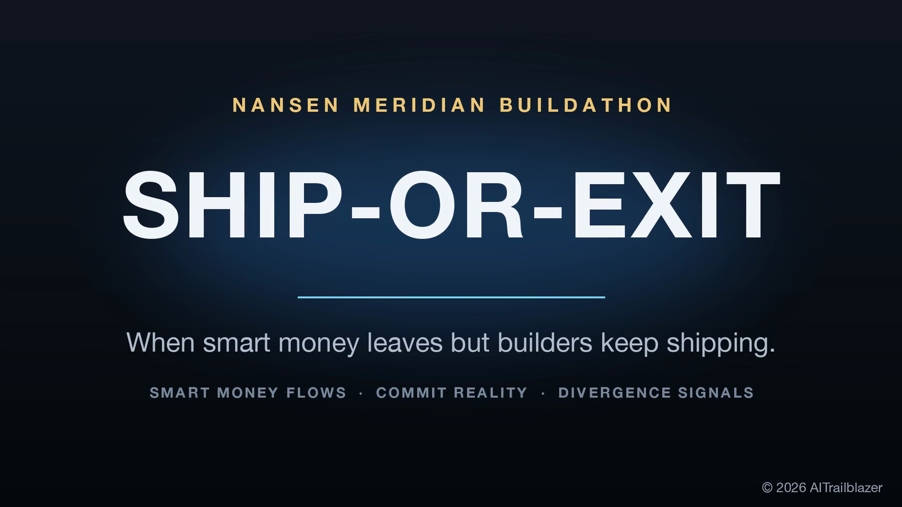
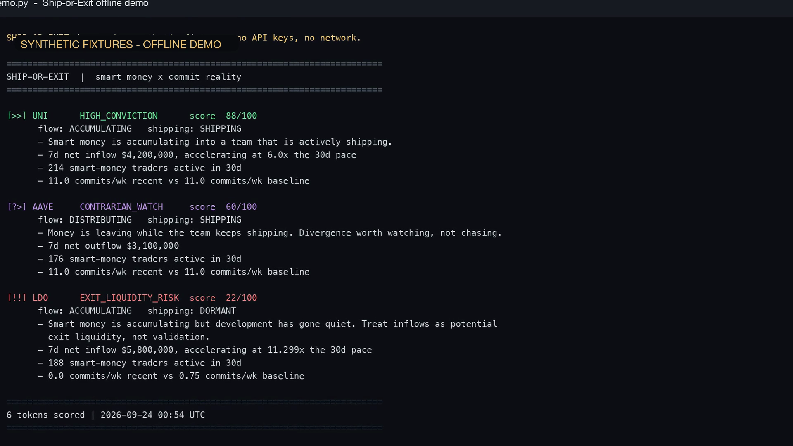
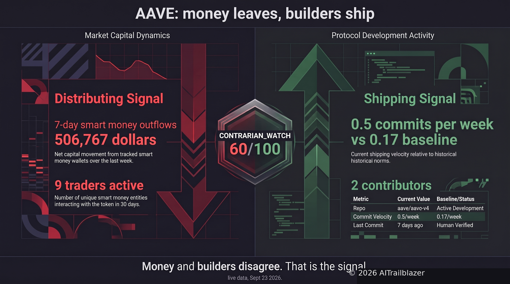
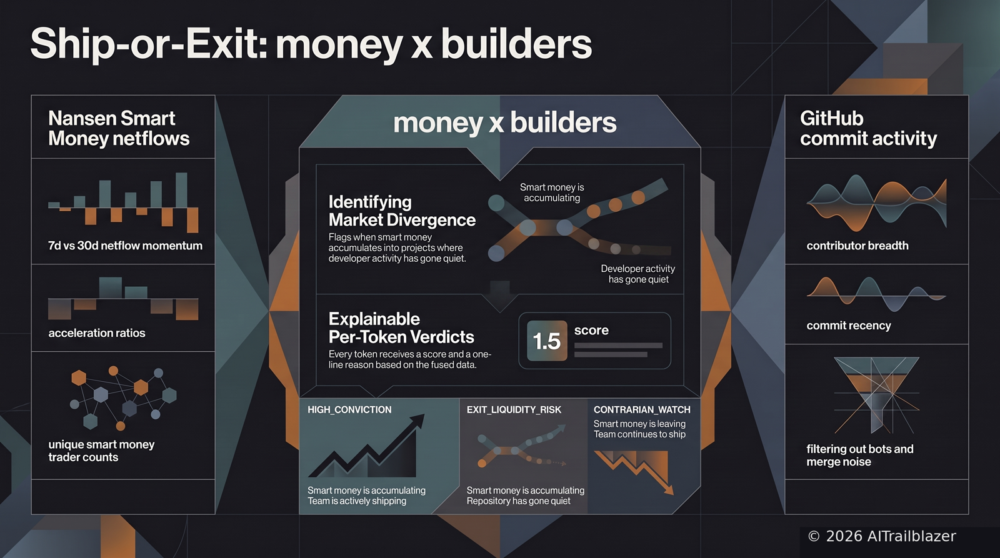
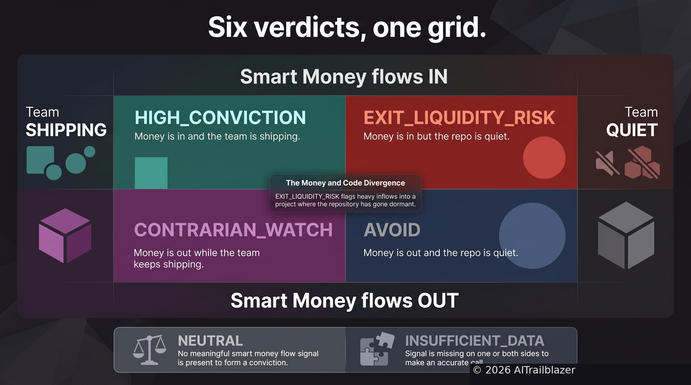

# Ship-or-Exit



[](https://www.nansen.ai/)
[](https://www.python.org/)
[](LICENSE)
[](https://youtu.be/mmpeiajsirk)

**A commit-intelligence agent on Nansen smart money.** Entry for the Nansen Meridian Buildathon (Sep 14-27, 2026).

Nansen tells you where smart money is flowing. GitHub tells you whether anyone is still building. Ship-or-Exit fuses both and flags the divergence.

## Watch the demo

[](https://youtu.be/mmpeiajsirk)

2:26 walkthrough: the idea, a zero-key synthetic demo covering all six verdicts, then a live AAVE read. Click to watch on YouTube.

## The idea

Every token gets two independent reads:

1. **Flow momentum** from Nansen Smart Money netflows: 7-day vs 30-day rate, acceleration, active trader count.
2. **Development reality** from the protocol's active GitHub repo: commit velocity vs its own baseline, contributor breadth, recency. Merge commits and bots are filtered out.

The fusion is a verdict with reasons you can verify in under a minute:

| Verdict | Meaning |
|---|---|
| `HIGH_CONVICTION` | Flows in, team shipping |
| `EXIT_LIQUIDITY_RISK` | Flows in, repo quiet. The money/code divergence. |
| `CONTRARIAN_WATCH` | Flows out, team shipping |
| `AVOID` | Flows out, repo quiet |
| `NEUTRAL` / `INSUFFICIENT_DATA` | No call |

Commits are a proxy, not proof. The agent flags evidence; it does not issue trade orders.

## Live evidence (September 23, 2026)

One verified live read, produced by `run_live.py` against real Nansen and GitHub data:

**AAVE: CONTRARIAN_WATCH, 60/100**

- Flow: DISTRIBUTING. $506,767 in 7-day Smart Money net outflows across 9 active traders.
- Development: SHIPPING. The mapped active repo (`aave/aave-v4`) held 0.5 commits/week against its own 0.17 baseline, with 2 contributors and the last commit 7 days earlier.

Money is leaving while the mapped active v4 repository keeps shipping. That disagreement is the signal the agent exists to catch. Analytical evidence only, not trading advice.

The `demo.py` path covers all six verdicts on synthetic fixtures so anyone can reproduce the full decision surface with zero keys. The live path above is where real data flows through the same code.

## Screenshots

The offline demo runs the full pipeline on synthetic fixtures and prints the verdict table to the terminal:



The live read pairs Nansen Smart Money netflows with the mapped active repository:





All six verdicts in one view:



## Quickstart (under 10 minutes)

```bash
git clone https://github.com/aitrailblazer/ship-or-exit.git
cd ship-or-exit
pip install -r requirements.txt
python demo.py
```

That is the whole demo: synthetic fixtures, zero keys, zero network. It prints the full report to the terminal and writes `demo_report.md`. This is exactly what the demo recording shows.

### Live mode (real Nansen + GitHub data)

1. Create a free Nansen API key at https://app.nansen.ai/api
2. `export NANSEN_API_KEY=<your key>`
3. `export GITHUB_TOKEN=<your token>` (optional, raises GitHub rate limits)
4. `python run_live.py`

Live mode reads `config/watchlist.json` (10 protocols mapped to their authoritative repos) and writes `report.md`.

### Watchlist curation

A token is listed only if **both** signals are available: Nansen must return a smart-money netflow record for it, and its mapped repo must be the place where protocol development is currently happening (verified via GitHub push activity, not legacy docs). Tokens Nansen does not track (SNX, COMP, DYDX as of 2026-09-23) are excluded rather than reported as perpetual `INSUFFICIENT_DATA`. ETH and BTC are absent for the same reason: the endpoint rejects native ETH/SOL as invalid addresses, and the wrapped proxies (WETH, WBTC) return zero netflow records across all chains, so neither major can be scored. Repo mappings are corrected when development moves: UNI v4-core to v4-periphery (core dormant since Apr 2026), MKR to SKY (governance migration, 1:24,000), sky-ecosystem/dss to spells-mainnet (dss dead since 2023), curvefi/curve-contract to curve-stablecoin (crvUSD is current development), AAVE v3-origin to aave-v4 (v3 is finished/maintenance; v4 is the active development surface).

### The 1,000-call entry gate

```bash
export NANSEN_API_KEY=<your key>
python backfill.py
```

This makes 1,000 genuine Nansen API calls across cheap endpoints only (smart-money netflow at 5 credits/call, sweeping chains x label cohorts x sort orders). Every call is logged to `.call_log.jsonl` with endpoint, credits used, credits remaining, and latency. Cost: 5,000 credits total. During the buildathon window (Sep 14-27) credit purchases are doubled, so one $10 pack (10,000 to 20,000 credits) covers this several times over. Premium-label and agent endpoints are never touched.

## How it works

```
config/watchlist.json  ->  token, chain, contract, repo
        |
        v
NansenClient (ship_or_exit/nansen.py)
  POST /api/v1/smart-money/netflow, apikey header auth
  persistent JSONL call log: endpoint, credits, latency, hash
        |
        v
GitHubClient (ship_or_exit/github.py)
  commit history, 112d window, paginated
  is_human(): drops merge commits and bot accounts
        |
        v
metrics.py  ->  flow acceleration (7d vs 30d rate), commit velocity
                vs the repo's own baseline, contributor breadth, recency
        |
        v
scoring.py  ->  explainable fusion into verdict + score + reasons
        |
        v
report.py   ->  terminal table (for the demo recording) + markdown
```

Repos are scored against their own history, never against each other. A mature protocol ships at a different cadence than a new launch.

## Project layout

```
ship_or_exit/           agent package (nansen, github, metrics, scoring, agent, report, fixtures)
config/watchlist.json   10-token curated watchlist with repo mappings
demo.py                 zero-key demo (this is what the recording shows)
run_live.py             real-data run, writes report.md
backfill.py             1,000-call gate runner, writes .call_log.jsonl
assets/                 screenshots and title card for this README
JUDGING.md              how this maps to the four judging criteria
SUBMIT.md               submission checklist
```

## Limitations (read before trusting a verdict)

- Nansen netflow history is a rolling 30 days; flow "acceleration" is window-rate comparison, not a true time series.
- Commits miss private development, maintenance-mode projects, and multi-repo orgs. A quiet public repo is a flag, not a conviction.
- Token-to-repo mappings are curated by hand; wrong mappings produce wrong verdicts. Unmapped tokens return INSUFFICIENT_DATA rather than a guess.

## License

MIT. See [LICENSE](LICENSE).

---
© 2026 AITrailblazer. Analytical evidence only. Not trading advice.
